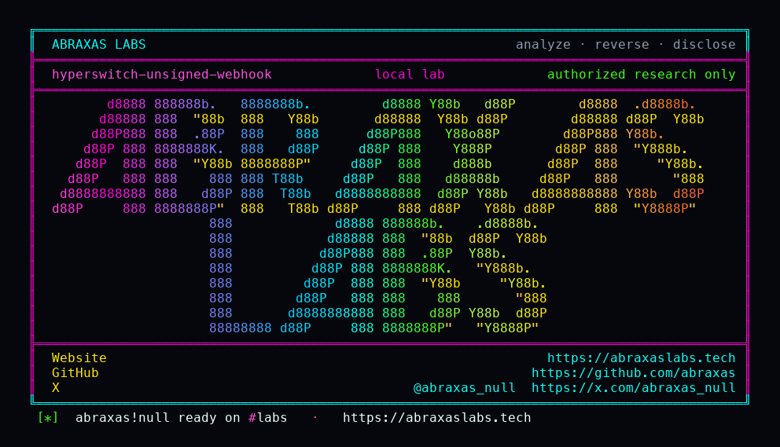

<p align="center">
  
</p>

<p align="center">
  <a href="https://abraxaslabs.tech"><strong>abraxaslabs.tech</strong></a>
  &nbsp;·&nbsp;
  <a href="https://github.com/abraxas">github.com/abraxas</a>
  &nbsp;·&nbsp;
  <a href="https://x.com/abraxas_null">@abraxas_null</a>
  &nbsp;·&nbsp;
  <a href="mailto:abraxas.null@proton.me">abraxas.null@proton.me</a>
  &nbsp;·&nbsp;
  <a href="https://github.com/abraxas/hyperswitch-unsigned-webhook">hyperswitch-unsigned-webhook</a>
</p>

# hyperswitch-unsigned-webhook

**Hyperswitch** `2026.09.21.0` - Juspay

[`Worldpayxml::verify_webhook_source`](https://github.com/juspay/hyperswitch/blob/2026.09.21.0/crates/hyperswitch_connectors/src/connectors/worldpayxml.rs) returns `Ok(true)` with a comment that verification is done via mTLS. There is no mTLS on this route. The function ignores the body and the headers. [`incoming.rs`](https://github.com/juspay/hyperswitch/blob/2026.09.21.0/crates/router/src/core/webhooks/incoming.rs) then trusts `source_verified` and takes `HandleResponse` with no PSync. [`LastEvent::Settled`](https://github.com/juspay/hyperswitch/blob/2026.09.21.0/crates/hyperswitch_connectors/src/connectors/worldpayxml/transformers.rs) maps to `PaymentIntentSuccess`. The default [`IncomingWebhook`](https://github.com/juspay/hyperswitch/blob/2026.09.21.0/crates/hyperswitch_interfaces/src/webhooks.rs) algorithm is [`NoAlgorithm`](https://github.com/juspay/hyperswitch/blob/2026.09.21.0/crates/common_utils/src/crypto.rs). BitPay and Shift4 inherit that. Worldpayxml does not even get that far. It short-circuits.

**Unauthenticated dummy SETTLED XML marks the payment succeeded. No Worldpay capture. No client cert.**

| | |
|---|---|
| ID | no CVE yet |
| CWE | [CWE-345](https://cwe.mitre.org/data/definitions/345.html), [CWE-306](https://cwe.mitre.org/data/definitions/306.html) |
| CVSS | **High: 7.5** `CVSS:3.1/AV:N/AC:L/PR:N/UI:N/S:U/C:N/I:H/A:N` |
| Product | [Hyperswitch](https://github.com/juspay/hyperswitch) |
| Affected | through **2026.09.21.0** Worldpayxml inbound webhooks |
| Auth | unauthenticated; need merchant_id and orderCode |
| License | [GNU Affero GPL v3.0](LICENSE) |
| Lab | `127.0.0.1` only |

## What an attacker can do

Need `merchant_id` (in every Hyperswitch dashboard URL) and `orderCode` equal to the attempt's `connector_transaction_id`. POST `/webhooks/{merchant_id}/worldpayxml` unsigned SETTLED. If `source_verified` were false, incoming would `Trigger` and PSync the connector. Worldpayxml never takes that path. Intent goes **Charged**. Lab: `status=succeeded`. Dummy XML. No PSP.

Guessing payment ids is not the bug. Forging SETTLED for an id you already saw is. Not a shell. Not a live Worldpay settlement.

Same product, different bug: [payout confirm unbound client_secret](https://github.com/abraxas/hyperswitch-payout-confirm-secret).

## How I found it

I read `Ok(true)`, then `HandleResponse` vs `Trigger`, then `Settled -> PaymentIntentSuccess`. The comment says mTLS. The lab POST has no client cert.

The first client that looks at this will POST the webhook against `requires_confirmation`. Incoming will not Charged a payment that has not left confirmation. Stamp the attempt, or wait until `requires_capture` / `processing`. Lab does the stamp. That stamp is a lab fixture. A live attempt already has the connector id. The webhook does not.

Wrong turns already recorded: signed HMAC on a connector that actually verifies (this path does not); treating webhook HTTP 200 as the oracle (poll `GET /payments/{id}` until `status=succeeded`); `orderCode` that is not `connector_transaction_id`; a reverse shell. Theatre.

Then: merchant, API key, worldpayxml MCA, payment with `confirm=false`, stamp `connector_transaction_id`, unsigned SETTLED, retrieve.

## Lab

```bash
cd lab
./run.sh
```

Target **only** `http://127.0.0.1:18082`. `run.sh` clones tag **2026.09.21.0** into `lab/hyperswitch-src` for config and migrations.

```text
IOC status_before=requires_confirmation
IOC webhook status=200 unsigned lastEvent=SETTLED
IOC poll status=succeeded
SUCCESS Hyperswitch unsigned Worldpayxml webhook Charged
```

## The fix

Verify the Worldpay notify (signature / mTLS that the route actually terminates). Do not `HandleResponse` on a connector that returned `Ok(true)` from a no-op. Unsigned SETTLED must not move the intent to succeeded.

## References

- [github.com/juspay/hyperswitch](https://github.com/juspay/hyperswitch) tag [2026.09.21.0](https://github.com/juspay/hyperswitch/releases/tag/2026.09.21.0)
- [`worldpayxml.rs`](https://github.com/juspay/hyperswitch/blob/2026.09.21.0/crates/hyperswitch_connectors/src/connectors/worldpayxml.rs) · [`transformers.rs`](https://github.com/juspay/hyperswitch/blob/2026.09.21.0/crates/hyperswitch_connectors/src/connectors/worldpayxml/transformers.rs) · [`incoming.rs`](https://github.com/juspay/hyperswitch/blob/2026.09.21.0/crates/router/src/core/webhooks/incoming.rs) · [`webhooks.rs`](https://github.com/juspay/hyperswitch/blob/2026.09.21.0/crates/hyperswitch_interfaces/src/webhooks.rs) · [`crypto.rs`](https://github.com/juspay/hyperswitch/blob/2026.09.21.0/crates/common_utils/src/crypto.rs)
- Same product: [hyperswitch-payout-confirm-secret](https://github.com/abraxas/hyperswitch-payout-confirm-secret)
- [CWE-345](https://cwe.mitre.org/data/definitions/345.html) · [CWE-306](https://cwe.mitre.org/data/definitions/306.html)

## License

GNU Affero GPL v3.0. See [LICENSE](LICENSE). Loopback lab only. No warranty.
